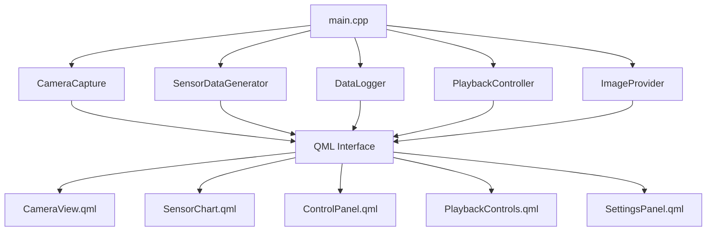

# Camera Sensor Dashboard

A Qt6/QML-based camera and sensor data acquisition dashboard application with synchronized frame and sensor data playback.

## Overview

This application provides a comprehensive data acquisition and analysis platform featuring:

- **Live Camera Feed**: Real-time camera capture and display using OpenCV
- **Sensor Data Generation**: Simulated sensor data (temperature and pressure)
- **Synchronized Data Logging**: CSV-based logging with timestamped frame references
- **Interactive UI**: Modern QML-based user interface with comprehensive controls
- **Advanced Playback**: Frame-synchronized data visualization and analysis
- **Frame-Synchronized Playback**: Camera frames automatically sync with sensor data during replay

##  Features

###  **Camera System**
- **Live Camera Feed**: Real-time webcam capture using OpenCV 4.x
- **Auto Frame Saving**: Automatic image capture every 5 seconds during recording
- **Multiple Resolutions**: 640x480, 1280x720, 1920x1080 support
- **Professional Image Storage**: JPEG format with timestamp naming

###  **Sensor Data System** 
- **Dual Sensor Simulation**: Temperature (15-35°C) and Pressure (990-1030 hPa)
- **Configurable Sample Rates**: 0.5Hz, 1.0Hz, 5.0Hz with real-time switching
- **Live Visualization**: Real-time scrolling charts with smooth animations
- **Statistical Display**: Current values with color-coded indicators

###  **Data Management**
- **Automatic CSV Logging**: Complete sensor data with ISO timestamps
- **Synchronized Storage**: Camera frames and sensor data perfectly aligned
- **Professional File Naming**: `sensor_log_YYYYMMDD_HHMMSS.csv` format
- **Organized Structure**: All data stored in `build/data/` directory

###  **Enhanced Playback System**
- **Advanced Controls**: Play, Pause, Stop, Rewind, Forward
- **Variable Speed**: 0.1x to 10x playback with smooth transitions
- **Frame-by-Frame**: Precise data point navigation
- **Progress Seeking**: Click-to-jump timeline navigation
- **Loop Mode**: Automatic replay functionality
- **Bookmark System**: Mark important data points
- **Exit Functionality**: Clean return to live data mode

###  **User Interface**
- **Responsive Design**: Clean, professional Qt Quick interface
- **Real-time Status**: Visual indicators for all system components
- **Settings Panel**: Instant configuration changes
- **Error Handling**: User-friendly error dialogs
- **Data Access**: Quick "Open Data Folder" functionality
## Prerequisites

### System Requirements
- Linux (Ubuntu/Debian recommended)
- Camera device (USB webcam or built-in camera)
- Qt6 development environment
- OpenCV libraries

### Dependencies

#### Required Packages (Ubuntu/Debian)
```bash
# Update package list
sudo apt update

# Qt6 development packages
sudo apt install qt6-base-dev qt6-declarative-dev qt6-tools-dev
sudo apt install qt6-qml-dev qt6-multimedia-dev

# OpenCV for camera capture
sudo apt install libopencv-dev opencv-data

# Build tools
sudo apt install cmake build-essential pkg-config

# Add user to video group for camera access (requires logout/login to take effect)
sudo usermod -a -G video $USER
```

#### Alternative Installation (if Qt6 packages not available)
```bash
# For older Ubuntu versions, you might need Qt5
sudo apt install qtbase5-dev qtdeclarative5-dev qttools5-dev
sudo apt install qml-module-qtquick2 qml-module-qtquick-controls2
sudo apt install qml-module-qtquick-layouts qml-module-qtquick-dialogs

# Note: You'll need to modify CMakeLists.txt to use Qt5 instead of Qt6
```

## Project Structure

```
camera-sensor-dashboard/
├── CMakeLists.txt          # Build configuration
├── launch_dashboard.sh     # Application launcher script
├── src/                    # Source code
│   ├── main.cpp           # Application entry point
│   ├── CameraCapture.cpp  # Camera handling logic
│   ├── DataLogger.cpp     # Data logging functionality
│   ├── SensorDataGenerator.cpp # Sensor data simulation
│   ├── ImageProvider.cpp  # QML image provider
│   └── PlaybackController.cpp # Data playback control
├── include/               # Header files
│   ├── CameraCapture.h
│   ├── DataLogger.h
│   ├── SensorDataGenerator.h
│   ├── ImageProvider.h
│   └── PlaybackController.h
├── qml/                   # QML UI files
│   ├── main.qml          # Main application window
│   ├── CameraView.qml    # Camera feed display
│   ├── ControlPanel.qml  # Control buttons
│   ├── PlaybackControls.qml # Data playback UI
│   ├── SensorChart.qml   # Sensor data visualization
│   ├── SettingsPanel.qml # Settings interface
│   ├── ErrorDialog.qml   # Error handling
│   └── qml.qrc          # Qt resource file
└── build/                        # Generated build files (created at runtime)
    └── data/                     # Generated data files 
        ├── frame_*.jpg           # Camera frame images
        └── sensor_log_*.csv      # Sensor data CSV files
```

## Build Instructions

1. **Create build directory:**
   ```bash
   mkdir build && cd build
   ```

2. **Configure with CMake:**
   ```bash
   cmake ..
   ```

3. **Compile:**
   ```bash
   make -j$(nproc)
   ```

4. **Run application:**
   ```bash
   ./camera-sensor-dashboard
   ```

## Usage

1. **Start the Application:**
   - Run `./camera-sensor-dashboard` from the build directory
   - The application will launch with the camera view and control panel

2. **Camera Operations:**
   - Click "Start Acquisition" to begin camera capture and sensor data logging
   - The live camera feed will appear in the main view
   - Click "Stop Acquisition" to halt capture and logging

3. **Data Logging:**
   - Sensor data is automatically logged to CSV files in the `data/` directory
   - Log files are timestamped: `sensor_log_YYYYMMDD_HHMMSS.csv`
   - Data includes: timestamp, temperature, humidity, pressure, and accelerometer readings

4. **Playback:**
   - Use playback controls to review previously logged data
   - Navigate through recorded sessions with timeline controls

### Settings Configuration

#### Camera Settings
- **Resolution**: Choose from 640x480, 1280x720, or 1920x1080
- Changes apply when camera is restarted

#### Sensor Settings
- **Sampling Rate**: Select 0.5 Hz, 1.0 Hz, or 5.0 Hz
- Changes apply immediately during acquisition

### Data Logging and Playback

#### Automatic Logging
- When acquisition starts, a new CSV file is automatically created
- Files are saved in the `data/` directory within the application folder
- File format: `sensor_log_YYYYMMDD_HHMMSS.csv`

#### CSV File Format
```csv
Timestamp,Temperature(C),Pressure(hPa),FrameFile
2024-01-15T10:30:01,23.5,1013.2,frame_20240115_103005.jpg
2024-01-15T10:30:02,24.1,1012.8,
2024-01-15T10:30:03,23.8,1012.9,
2024-01-15T10:30:04,24.0,1013.0,
2024-01-15T10:30:05,24.2,1012.7,frame_20240115_103010.jpg
```

#### Frame Synchronization System
The application implements a sophisticated frame-sensor data synchronization system:

**Data Acquisition:**
- **Sensor Data**: Collected every 1 second (configurable)
- **Camera Frames**: Captured and saved every 5 seconds
- **Timestamp Alignment**: All data uses synchronized ISO timestamps
- **Frame References**: CSV includes frame filename when available

**Playback Synchronization:**
- **Automatic Frame Loading**: System loads corresponding frame images during playback
- **Timestamp Matching**: Frames displayed based on closest timestamp match
- **Seamless Switching**: Camera view automatically switches between live and playback modes
- **Path Resolution**: Intelligent path resolution for frame files (absolute/relative)
- **Error Handling**: Placeholder images shown when frames are missing

**Implementation Details:**
- `CameraCapture`: Saves frames every 5 seconds with timestamp naming
- `DataLogger`: Records frame filenames in CSV alongside sensor data
- `PlaybackController`: Emits frame references during data replay
- `ImageProvider`: Manages frame loading and display switching
- `CameraView`: Automatically refreshes to show synchronized frames

#### Loading Recorded Data
1. Click **"Load Recorded Data"** button
2. Select a CSV file from the file dialog
3. Playback controls will appear

#### Playback Controls
- **Play/Pause**: Start or pause data replay
- **Stop**: Stop playback and return to beginning
- **Rewind**: Jump back 10 seconds
- **Forward**: Jump forward 10 seconds
- **Speed Control**: Adjust playback speed (0.1x to 10.0x)
- **Progress Slider**: Seek to any point in the data

### Application Architecture


| **Sample Rate** | **Interval** | **Use Case** |
|----------------|--------------|-------------|
| 0.5 Hz         | 2000ms      | Long-term monitoring |
| 1.0 Hz         | 1000ms      | Standard monitoring (default) |
| 5.0 Hz         | 200ms       | High-frequency analysis |

## Troubleshooting

### Camera Issues
- **No camera detected**: Check if camera device exists (`ls /dev/video*`)
- **Permission denied**: Ensure user is in `video` group (`groups $USER`)
- **VirtualBox users**: May need to enable USB 2.0/3.0 controller in VM settings

### Build Issues
- **Qt6 not found**: Install qt6-base-dev package
- **OpenCV not found**: Install libopencv-dev package
- **CMake errors**: Ensure CMAKE_PREFIX_PATH includes Qt6 installation

### Runtime Issues
- **Black camera feed**: Check camera permissions and VirtualBox USB settings
- **No sensor data**: Verify data logging is enabled and data/ directory is writable
- **QML errors**: Check Qt6 QML modules are properly installed

## Technical Details

### Camera Capture
- Uses OpenCV VideoCapture with V4L2 backend
- Automatic fallback and retry mechanisms for VirtualBox compatibility

### Data Format
CSV log format includes:
- Timestamp (YYYY-MM-DD HH:MM:SS.mmm)
- Temperature (°C)
- Humidity (%)
- Pressure (hPa)

## Development Notes

### Architecture
- **Backend**: C++ classes handle camera capture, sensor simulation, and data management
- **Frontend**: QML provides the user interface with data binding
- **Communication**: Qt signals/slots for real-time data updates

### Key Components
- **CameraCapture**: OpenCV-based camera handling with frame saving
- **SensorDataGenerator**: Random data generation with configurable rates
- **DataLogger**: CSV file management and data persistence
- **PlaybackController**: Recorded data replay functionality
- **ImageProvider**: QML image provider for camera frames


